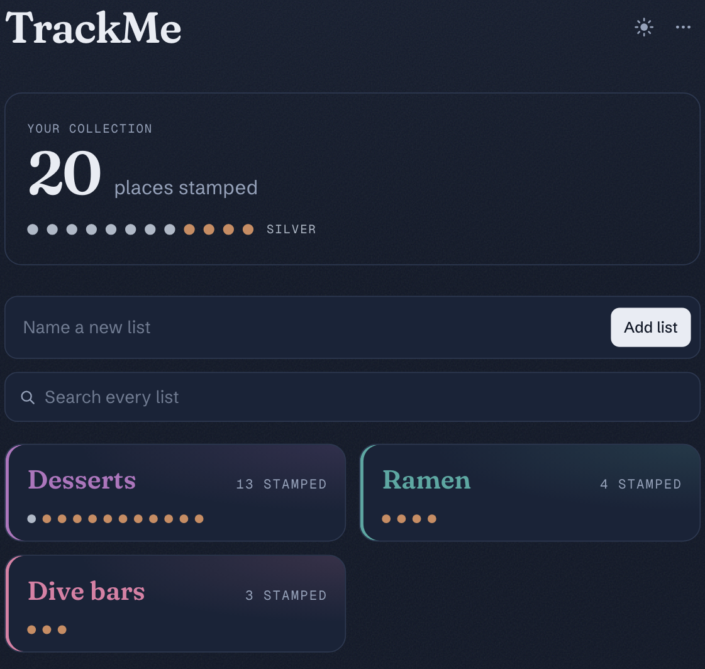
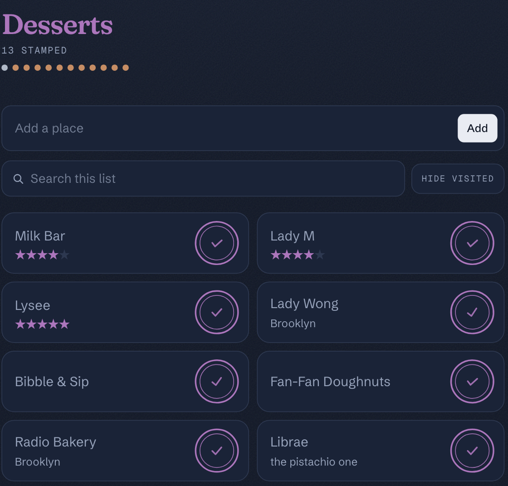

# TrackMe

**A passport for the places you want to try.** Keep living lists — desserts, ramen,
dive bars, whatever you're chasing — and press a stamp on each place the day you
finally go. The reward isn't finishing a list; it's the stamp.

TrackMe is a local-first Progressive Web App: it opens instantly, works with no
signal, and syncs when it can. Built for the moment you're standing outside a
bakery with one bar of service.

<p align="center">
  
  
</p>

## The idea

Lists here are collections that keep growing and are never "done." So TrackMe
deliberately has **no completion states** — no `3/8` fractions, no empty slots
counting your backlog, no finish-line confetti. Adding a place you're excited
about should never make a number look worse.

Instead it measures only what you've *collected*:

- **Your collection** — a lifetime count of everywhere you've stamped, the one
  number that only ever grows.
- **A stamp press** — the whole reward, fired on every visit, forever. Each place
  gets its own hand-pressed angle so no two stamps sit quite alike.

## Features

- **Lists of places** with optional notes, location, a tappable star rating, and a
  link — all optional, because most places start as just a name.
- **Two colour systems that answer different questions.**
  - *Ink* — which list this is. Each list owns a hue; its places are stamped in it,
    and its name carries it. Auto-assigned so lists look distinct out of the box,
    changeable with a one-tap swatch.
  - *Rank* — how deep you've gone. A universal ladder (copper → silver → gold →
    emerald → violet), shared across every list, so rank is comparable at a glance.
    The dot row caps at twelve but keeps meaning more: past twelve, dots convert to
    the next rank one visit at a time.
- **Search that earns its place** — appears once a list is big enough to need it.
  From the home screen it spans every list; inside a list it searches just that
  one. Matches name, address, and notes. Debounced, and entirely local, so it
  works offline.
- **Hide visited** — once a list is mostly stamped, the places you *haven't* been
  are what you want to see. A global, remembered toggle that filters the view
  without touching the counts.
- **Offline-first** — every read and write goes to the browser's own database
  first, so the UI never waits on the network. Changes queue and sync in the
  background; conflicts resolve last-write-wins.
- **Installable** — a real PWA with an offline fallback, so it lives on your home
  screen like any app.
- **Light and dark**, with a texture that makes the cards feel like pages.

## How it works

TrackMe is **local-first**. The client reads and writes [IndexedDB](https://developer.mozilla.org/docs/Web/API/IndexedDB_API)
(via Dexie) as its source of truth and renders straight from it, so pages load
without a server round-trip and every action works offline. A background sync
engine pushes queued changes to a custom `/api/sync` endpoint and pulls remote
ones, using two timestamps per record — one client-authored (for
last-write-wins) and one server-authored (for the pull cursor) — plus soft
deletes so removals propagate too. Per-user isolation is enforced at the database
with Row Level Security.

## Tech

- **[Next.js](https://nextjs.org)** (App Router) + **React** + **TypeScript**
- **[Tailwind CSS](https://tailwindcss.com)** v4
- **[Supabase](https://supabase.com)** — Postgres + Auth (email/password and Google)
- **[Prisma](https://www.prisma.io)** ORM, with Row Level Security
- **[Dexie](https://dexie.org)** (IndexedDB) for the offline store
- Deployed on **[Vercel](https://vercel.com)**

## Getting started

You'll need a free Supabase project for the database and auth. Full walkthrough —
keys, connection strings, migrations, optional Google sign-in — is in
**[SETUP.md](./SETUP.md)**. The short version:

```bash
npm install
cp .env.example .env.local     # fill in your Supabase values
npm run db:migrate             # create the tables
npm run dev                    # http://localhost:3000
```

### Scripts

| Command | What it does |
| --- | --- |
| `npm run dev` | Start the dev server |
| `npm run build` | Generate the Prisma client and build for production |
| `npm run start` | Run the production build |
| `npm run lint` | Lint |
| `npm run db:migrate` | Create/apply a database migration |
| `npm run db:studio` | Open Prisma Studio to browse the data |

## Deploying

Import the repo in Vercel, add the same four environment variables from
`.env.local`, and deploy. Then point Supabase's **Authentication → URL
Configuration** (Site URL and redirect URLs) at your Vercel domain.
